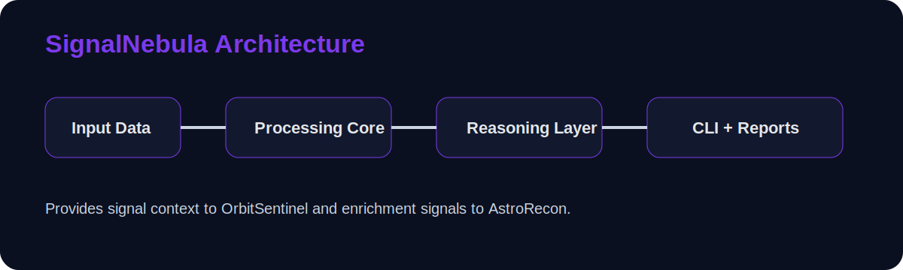

# SignalNebula

<p align="center">
  
</p>

<p align="center">
  
</p>

```text
SIGNALNEBULA
```

**Signal intelligence workbench for space communication channels**

   

**Related:** [AstroRecon](../AstroRecon) • [OrbitSentinel](../OrbitSentinel)

## Overview

Processes RF-like samples, extracts signal quality metrics, and produces interference and drift reports.

## Why this repo exists

SignalNebula is part of a space-AI-security ecosystem designed to look and behave like a small open research lab. It ships with runnable code, sample data, a CLI, tests, Docker support, architecture notes, and ADR-style design records so the repository feels serious the second someone lands on it.

## Architecture

<p align="center">
  
</p>

**Pipeline**

Signal sample ingest → denoising stats → SNR / drift estimation → findings

## Quick start

```bash
python -m venv .venv
source .venv/bin/activate
pip install -r requirements.txt
python -m signalnebula.cli analyze data/sample_signal.csv
python -m signalnebula.cli spectrum data/sample_signal.csv
```

## Docker

```bash
docker build -t signalnebula .
docker run --rm signalnebula
```

## Repository layout

```text
signalnebula/
├── signalnebula/
│   ├── cli.py
│   ├── engine.py
│   ├── models.py
│   └── utils.py
├── data/
├── docs/
│   ├── architecture.md
│   └── adr/
├── tests/
├── assets/
├── README.md
├── requirements.txt
├── Dockerfile
└── LICENSE
```

## Documentation

- `docs/architecture.md` for end-to-end system design
- `docs/adr/ADR-001.md` for processing choices
- `docs/adr/ADR-002.md` for report strategy
- `docs/adr/ADR-003.md` for ecosystem links

## Tests

```bash
pytest
```

## Notes

This project is a **research-style prototype** with sample datasets and operator-friendly outputs. It is intentionally presentation-heavy, but it still runs and produces real output from bundled data.

## License

MIT
